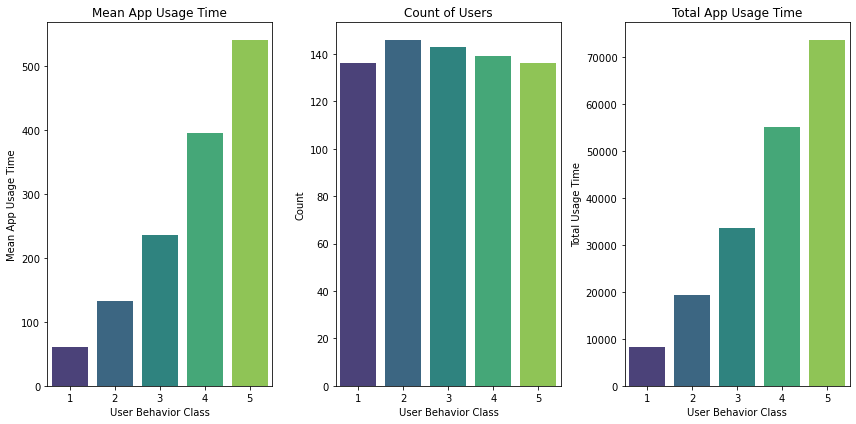
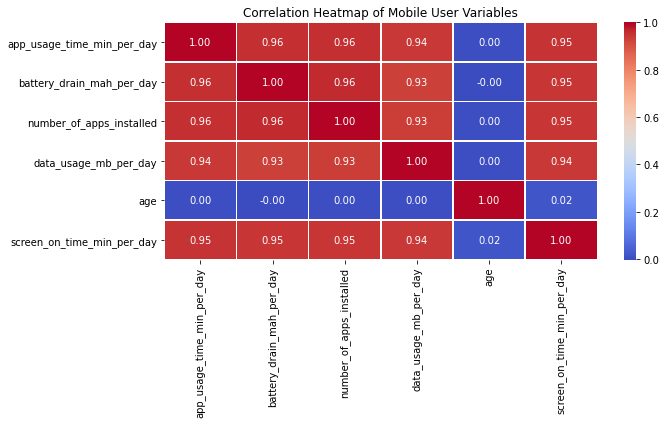

# Mobile User Behavior Analysis

## Key Visualizations

### User Behavior Class

This visualization shows that mobile user behavior classes are strongly associated with the amount of time users spend
on their mobile devices.  Higher behavior classes exhibit greater overall app usage activity.

---

### Correlation Heatmap

The heatmap highlights strong positive relationships between app usage time, screen-on time, battery drain, and data usage, suggesting that increased device activity contributes to higher resource consumption.

---

## Exploratory Data Analysis & Statistical Inference

This project applies Exploratory Data Analysis (EDA) and statistical inference techniques to investigate mobile user behavior patterns across Android and iOS operating systems and five mobile device models.  

The analysis explores relationships between application usage time, screen-on activity, battery consumption, data usage, and number of installed applications.  Inferential statistical techniques including the independent t-test and one-way ANOVA are utilized to determine whether observed differences between user groups are statistically significant. 

---

## Project Objectives

This project aims to answer the following questions:
  - How do mobile phone users behave in terms of application usage, screen activity, battery consumption, and data utilization?
  - Do users behave differently across mobile device models?
  - Is there statistically significant difference in battery drain between Android and iOS operating systems?
  - Does data usage significantly differ across mobile device models?

---

## Dataset Information

The dataset contains behaviroal information from 700 mobile pnone users and includes:
- Device model
- operating system
- App usage time
- Screen-on time
- Number of installed applications
- Data usage
- Age
- Gender
- User behavior classification

---

## Analytical Workflow

1. Data Understanding
2. Data Cleaning and Preparation
3. Distribution Analysis of Individual Features
4. Descriptive Statistics
5. Correlation Analysis
6. Hypothesis Testing
7. Condlusion

---

## Technologies Used

- Python
- pandas
- NumPy
- Matplotlib
- Seaborn
- SciPy
- Jupyter Notebook
- Git & GitHub

--
## Statistical Methods

### Independent Two-Sample t-test

Use to compare average battery drain between Android and iOS operating systems.

### One-Way ANOVA

Used to evaluate differences in mean data usage across the five mobile device models.

### Assumption Checks
- Histogram inspection
- Q-Q plots
- Shapiro-Wilk normality test
- Levene's test for homogeneity of variance

---

## Visualizations

The project includes several visualizations such as :
 - Battery drain distribution histogram
 - Battery drain by device model
 - Battery drain by gender
 - Mobile devie market share pie chart
 - Correlation heatmap
 - Pairplot analysis

---

## Key Findings
- Strong positive relationships were identified between app usage time, screen-on time, battery drain, and data usage.
- iOS devices exhibited slighty higher average battery drain than Android devices.
- Statistical testing showed no significant difference in batttery drain between Android and iOS operation systems.
- ANOVA results indicated no statistically significant difference in mean data usage across the five mobile device models.
- User activity patterns appear to have a stronger influence on resource consumption than operating system or device model alone.

---

## Reproducibility

To run this  project locally:
**git clone https://github.com/TontonGit/mobile-user-behavior-analysis.git**

Install required libraries:

**pip install pandas numpy matplotlib seaborn scipy**

Run the notebook from the **notebooks/** directory.

---
## Author

Akowe Atty

